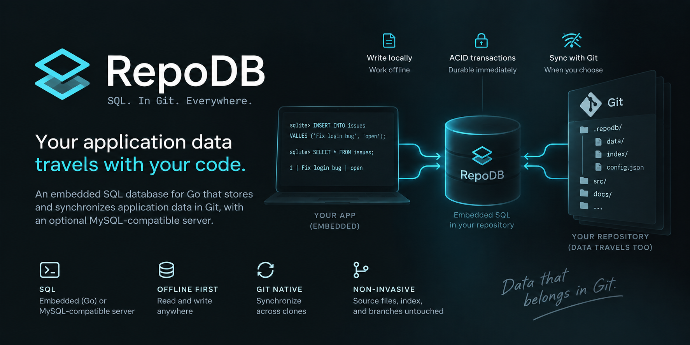

# RepoDB



RepoDB is an embedded SQL database for Go that stores and synchronizes
application data in Git, with an optional MySQL-compatible server.

Build agent tools, issue trackers, and dashboards whose data travels with a
repository. Write data locally, work offline, and synchronize across clones.
SQL transactions are durable immediately; data history is checkpointed to Git
when you choose. Source files, index, and code branches are never touched.

**Early development:** persistent SQL, synchronization, and three-way merging
are implemented and benchmarked. The current scope is small tool databases with
a documented [SQL subset](docs/sql-m2.md); broader compatibility and scaling
are on the roadmap. See the [scorecard](docs/benchmark.md) for measured
latency against MySQL 8 and Dolt.

## Quickstart

After [installing RepoDB](#installation), create a local demo repository and
start the server:

```sh
git init repodb-demo
cd repodb-demo
repodb init
repodb start
```

In a second terminal, create a table and query it:

```sh
repodb sql 'CREATE TABLE issues (id BIGINT PRIMARY KEY, title TEXT NOT NULL)'
repodb sql "INSERT INTO issues VALUES (1, 'Ship the first version')"
repodb sql 'SELECT * FROM issues'
```

Writes persist automatically. Stop and restart the server to read the same
data. The server listens on `127.0.0.1:3306` by default; any MySQL client
works:

```sh
mysql --host=127.0.0.1 --port=3306 --user=root repodb
```

### Synchronize an existing project

From a Git repository with a configured remote:

```sh
repodb enable --remote origin
repodb sync --remote origin
```

`enable` adopts existing remote database history or initializes an empty
catalog if neither side has one. It is safe to repeat and does not start a
server. On a fresh clone, run `enable` before creating a separate local
database with `init`.

`sync` fetches and publishes database changes, merging independent row edits.
Competing edits are preserved for explicit resolution:

```sh
repodb conflicts --remote origin
repodb resolve --remote origin --id '<conflict-id>' --take local
```

Resolution choices are `local`, `remote`, `base`, and `delete`. See the
[merge guide](docs/merge-m4.md) for row and schema conflict behavior.

**Use `repodb sync` to share database changes.** Ordinary `git push` publishes
source branches according to your Git configuration. A successful SQL write is
durable locally and does not imply that the remote has received it.

## Embedded use

For Go applications, add the module and use the engine directly:

```sh
go get github.com/nicbet/repodb/engine
```

```go
eng, err := engine.Open(ctx, ".")
defer eng.Close()

session, _ := eng.NewSession()
defer session.Close()

session.Exec(ctx, "CREATE TABLE events (id BIGINT PRIMARY KEY, data TEXT NOT NULL)")
session.Exec(ctx, "INSERT INTO events VALUES (?, ?)", 1, payload)

result, _ := session.Query(ctx, "SELECT data FROM events WHERE id = ?", 1)
```

The engine defaults to journal persistence: SQL commits are durable
immediately in a local journal, without creating a Git snapshot per
transaction. Call `engine.Checkpoint` to publish accumulated changes to Git
history, then `integration.Sync` to exchange them with a remote. No server
process, no background service.

## Installation

Build from source with **Go 1.27 or newer**, Git, and Make. The current
implementation requires POSIX file locking; the documented baseline uses macOS
and Git 2.55. See [storage and durability assumptions](docs/storage-format.md).

```sh
git clone https://github.com/nicbet/repodb.git
cd repodb
make build
export PATH="$PWD/bin:$PATH"
```

You can also install the command-line programs directly:

```sh
go install github.com/nicbet/repodb/cmd/repodb@latest
go install github.com/nicbet/repodb/cmd/repodb-server@latest
```

## Performance

Journal-mode point reads are sub-millisecond; single-row writes take ~5 ms
(one `fsync`). Batch writes of 100 rows beat MySQL and Dolt because the
journal appends one record regardless of batch size.

| Workload (50k rows) | MySQL 8 | Dolt | RepoDB Journal |
| --- | ---: | ---: | ---: |
| Point read | 0.23 ms | 0.39 ms | 0.11 ms |
| Read tx (10 reads) | 6.5 ms | 7.5 ms | 0.77 ms |
| Update x1 | 1.3 ms | 1.7 ms | 5.0 ms |
| Update x100 | 59 ms | 80 ms | 7.1 ms |
| Insert | 1.2 ms | 1.0 ms | 5.0 ms |

Range queries and full scans are slower because RepoDB decodes rows from a
content-addressed tree rather than scanning buffer-pool pages. Neither MySQL
nor Dolt provides Git-native version history or cross-clone synchronization.

See the [full scorecard](docs/benchmark.md) for methodology, concurrency,
sync latency, and the native-Git comparison.

## Development

```sh
make build
make test
go test -race ./common/repository ./engine ./integration
git diff --check
```

Run the [database scorecard](docs/benchmark.md):

```sh
make bench                         # Journal persistence (default)
make bench BENCH_MODE=native-git   # Native Git persistence
make bench-external                # MySQL 8 or Dolt baseline
```

## Architecture

```text
Go application          MySQL client
      |                       |
      |                  server/
      +-----------+-----------+
                  |
               engine/
        SQL tables and transactions
                  |
        common/prolly/ + common/repository/
        Immutable data, journal, and Git snapshots
                  |
         refs/repodb/data
                  |
             integration/
         Sync and reconciliation
                  |
              Git remote
```

- **One engine, two entry points.** Embedded sessions and MySQL connections
  share the same catalog, table adapters, and transaction implementation.
- **Journal persistence.** SQL commits append typed row edits (~1 KB per
  transaction) to a local journal with one `fsync`. Checkpoint materializes
  Prolly trees and publishes a Git data commit. Native-Git mode is available
  for workloads that need every transaction in Git history.
- **Snapshot isolation.** Transactions read a pinned snapshot plus their own
  writes. Stale writers receive a conflict instead of overwriting newer data.
- **Explicit synchronization.** Remote data is fetched into separate tracking
  refs. Sync validates, fast-forwards, or three-way-merges. Conflicts remain
  inspectable across restarts.

The current SQL scope supports one database namespace, explicit primary keys,
DDL/DML (including `ALTER TABLE`), secondary indexes (unique and non-unique),
`CHECK` constraints, `DEFAULT` values, and collation-aware string comparisons.
Persisted types include integers, floats, `TEXT`, `BLOB`, `BOOL`, `ENUM`,
`DECIMAL`/`NUMERIC`, `JSON`, `DATE`, `TIME`, `DATETIME`, and `TIMESTAMP`.
Auto-increment and foreign keys are not yet supported.

| Documentation | Covers |
| --- | --- |
| [SQL and embedded API](docs/sql-m2.md) | Supported types, transactions, commit recovery, and workload bounds |
| [Storage format](docs/storage-format.md) | Snapshots, object inventories, locking, durability, and legacy import |
| [Git integration](docs/git-integration.md) | Ref layout and ordinary Git command behavior |
| [Synchronization](docs/sync-m3.md) | Enable, tracking refs, and transport |
| [Merging](docs/merge-m4.md) | Three-way merge, conflict resolution, and distributed row identity |
| [Working state](docs/working-state.md) | Durable journal, checkpoints, and recovery |
| [Scorecard](docs/benchmark.md) | Four-way performance comparison and workload contract |

## Roadmap

- [x] **M0-M4:** Git storage, persistent SQL, sync, merging, journal persistence, and performance optimization.
- [x] **M5 (partial):** Example applications and tool-author validation.
- [ ] **M5 (remaining):** CLI completion (`commit`, `diff`).
- [x] **M6 (partial):** Secondary indexes, `ALTER TABLE`, expanded types and constraints, collation-aware comparisons.
- [ ] **M6 (remaining):** Auto-increment, foreign keys, and operational hardening.

See [the implementation plan](docs/plan.md) for milestone scope and acceptance criteria.

## Contributing

Issues and pull requests are welcome. For substantial changes, open an issue
to discuss the use case and approach first; the
[implementation plan](docs/plan.md) is the starting point for scope and
priorities.

Keep pull requests focused, format changed Go files with `gofmt`, and add
tests for behavioral changes. Run the development checks above and update
documentation when changing SQL behavior, storage, or synchronization.
