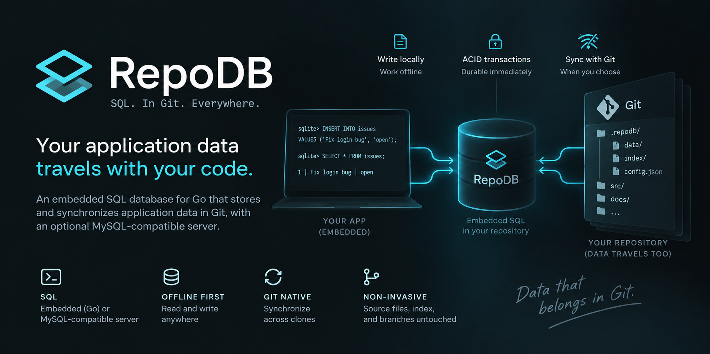

# RepoDB



RepoDB is an embedded SQL database for Go that stores and synchronizes application data in Git, with an optional MySQL-compatible server.

Build agent tools, issue trackers, and dashboards whose data travels with a repository. Write data locally, work offline, and synchronize across clones. SQL transactions are durable immediately; data history is checkpointed to Git when you choose. Source files, index, and code branches are never touched.

**Early development:** persistent SQL, synchronization, and three-way merging are implemented and benchmarked. RepoDB is aimed at local-first, version-controlled relational workloads with a documented [SQL subset](docs/sql.md). At the sizes measured so far (up to 50k rows) it serves point and indexed-range reads in well under a millisecond, full scans in tens of milliseconds, 100-row write batches in under 10 ms (journal mode), and cross-clone merges in 2–3 s. Concurrent writers are the main limitation: write transactions conflict whenever another commits first. Broader compatibility, write concurrency and scaling are on the roadmap. See the [latest benchmark results](docs/benchmarks/latest.md) for measured latency against MySQL 8 and Dolt.

## Quickstart

After [installing RepoDB](#installation), create a local demo repository and start the server:

```sh
# Create demo directory and initialize git
mkdir repodb-demo
cd repodb-demo
git init

# Initialize repodb refs
repodb init

# Start the SQL server
repodb start
```

The server listens on `127.0.0.1:3306` by default; any MySQL client works:

```sh
mysql --host=127.0.0.1 --port=3306 --user=root repodb
```

Writes persist automatically. Stop and restart the server to read the same data.

You can also use the `repodb sql` command directly. In a second terminal, create a table and query it:

```sh
repodb sql 'CREATE TABLE greetings (id BIGINT PRIMARY KEY, title TEXT NOT NULL)'
repodb sql "INSERT INTO greetings VALUES (1, 'Hello from RepoDB!')"
repodb sql 'SELECT * FROM greetings'
```

### Synchronize an existing project

From a Git repository with a configured remote:

```sh
repodb enable --remote origin
repodb sync
```

`enable` adopts existing remote database history or initializes an empty catalog if neither side has one. It is safe to repeat and does not start a server. On a fresh clone, run `enable` before creating a separate local database with `init`.

`sync` fetches and publishes database changes, merging independent row edits. Writes first land in a local journal; `repodb sync --commit -m '<message>'` turns them into a data commit and syncs (in a terminal, plain `repodb sync` offers to do this). Competing edits are preserved for explicit resolution:

```sh
repodb conflicts
repodb resolve --id '<conflict-id>' --take local
```

Resolution choices are `local`, `remote`, `base`, and `delete`. See [cli.md](docs/cli.md#synchronizing-with-a-remote) for row and schema conflict behavior.

After `enable`, all sync commands default to the configured remote. Pass `--remote` only to override.

**Use `repodb sync` to share database changes.** Ordinary `git push` publishes source branches according to your Git configuration. A successful SQL write is durable locally and does not imply that the remote has received it.

## CLI commands

| Command                       | Description                                                                |
| ----------------------------- | -------------------------------------------------------------------------- |
| `repodb init [path]`          | Initialize a RepoDB data namespace in a Git repository                     |
| `repodb start`                | Start a MySQL-compatible server (`--addr`, `--persistence`, `--durability`) |
| `repodb sql '<statement>'`    | Execute a SQL statement against a running server (`--addr`, `--database`)  |
| `repodb status`               | Show the data head, format version, object/table counts, and working state |
| `repodb diff`                 | Show uncommitted data changes (table-level change list)                    |
| `repodb commit -m '<msg>'`    | Checkpoint working data into a Git data commit                             |
| `repodb enable`               | Set up sync for a remote (`--remote`); safe to repeat                      |
| `repodb sync`                 | Fetch and publish data history (`--commit -m` checkpoints first)           |
| `repodb conflicts`            | List unresolved merge conflicts after a sync                               |
| `repodb resolve`              | Resolve a conflict (`--id`, `--take local\|remote\|base\|delete`)          |

## Embedded use

For Go applications, add the module and use the engine directly:

```sh
go get github.com/nicbet/repodb/engine
```

Build with `-tags gms_pure_go` (for example `go build -tags gms_pure_go ./...`, or set `GOFLAGS=-tags=gms_pure_go`). RepoDB uses go-mysql-server, whose default regular-expression backend links the ICU4C C library through cgo; the tag selects its pure-Go backend instead, so SQL `REGEXP` functions use Go's RE2 syntax. Without the tag you need cgo, a C++ toolchain, and ICU4C installed.

```go
eng, err := engine.Open(ctx, ".")
defer eng.Close()

session, _ := eng.NewSession()
defer session.Close()

session.Exec(ctx, "CREATE TABLE events (id BIGINT PRIMARY KEY, data TEXT NOT NULL)")
session.Exec(ctx, "INSERT INTO events VALUES (?, ?)", 1, payload)

result, _ := session.Query(ctx, "SELECT data FROM events WHERE id = ?", 1)
```

The engine, like the CLI and server, defaults to journal persistence: SQL commits are durable immediately in a local journal, without creating a Git snapshot per transaction. Call `engine.Checkpoint` to publish accumulated changes to Git history, then `integration.Sync` to exchange them with a remote. No server process, no background service.

## Installation

Build from source with **Go 1.26 or newer**, Git, and Make. The tested baseline is macOS with Git 2.55. Windows builds and passes `go vet` on every `make test`, but the test suite has not been run on Windows yet. See [durability and platforms](docs/architecture.md#durability-and-recovery).

```sh
git clone https://github.com/nicbet/repodb.git
cd repodb
make build
export PATH="$PWD/bin:$PATH"
```

You can also install the command-line programs directly:

```sh
go install -tags gms_pure_go github.com/nicbet/repodb/cmd/repodb@latest
go install -tags gms_pure_go github.com/nicbet/repodb/cmd/repodb-server@latest
```

## Performance

Measured 2026-10-02 at `87dd885` on an Apple M1 Max: p50 at 50k rows, with RepoDB embedded and MySQL and Dolt over loopback TCP. See [latest results](docs/benchmarks/latest.md) for all sizes, concurrency, sync, and the environment.

Journal mode, the default, serves point and range reads in well under a millisecond; single-row writes take ~5 ms (one `fsync`). Batch writes of 100 rows beat MySQL and Dolt because the journal appends one record regardless of batch size.

| Workload (50k rows) | MySQL 8.4 | Dolt 2.3 | RepoDB Journal |
| ------------------- | --------: | -------: | -------------: |
| Point read          |   0.22 ms |  0.38 ms |        0.09 ms |
| Range (100 rows)    |   0.38 ms |  0.49 ms |        0.13 ms |
| Full scan           |     27 ms |    38 ms |          35 ms |
| Read tx (10 reads)  |    6.2 ms |   7.0 ms |        0.60 ms |
| Update x1           |    1.1 ms |   1.5 ms |         5.1 ms |
| Update x100         |     44 ms |    73 ms |         7.3 ms |
| Insert              |   0.71 ms |  0.92 ms |         5.0 ms |

Full scans and joins still grow with table size, and a descending `ORDER BY … LIMIT` sorts the whole table until reverse index scans land. A write transaction is rejected rather than queued when another commits first, even if the two wrote different rows, so concurrent writers see conflicts that MySQL would not report. Journal-mode merge syncs take about 3 s at 50k rows. Neither MySQL nor Dolt provides Git-native version history or cross-clone synchronization.

See the [latest results](docs/benchmarks/latest.md) for concurrency, sync latency, and the native-Git comparison, and the [methodology](docs/benchmark.md) for how they are measured.

## Development

```sh
make build
make test
make lint
go test -race -tags gms_pure_go ./common/repository ./engine ./integration
git diff --check
```

Run the [database scorecard](docs/benchmark.md) ([how results are published](docs/benchmark.md#publishing-results)):

```sh
make bench-docker BENCH_MODE=journal     # RepoDB in Docker, like the baselines
make bench-docker BENCH_MODE=native-git
make bench-docker BENCH_MODE=external BENCH_SUFFIX=-mysql \
  BENCH_DSN='root@tcp(repodb-bench-mysql:3306)/'   # MySQL or Dolt baseline
```

## Architecture

```text
Go application          MySQL client
      |                       |
      |                  server/
      +-----------+-----------+
                  |
               engine/
        SQL tables and transactions
                  |
        common/prolly/ + common/repository/
        Immutable data, journal, and Git snapshots
                  |
         refs/repodb/data
                  |
             integration/
         Sync and reconciliation
                  |
              Git remote
```

- **One engine, two entry points.** Embedded sessions and MySQL connections share the same catalog, table adapters, and transaction implementation.
- **Journal persistence.** SQL commits append their row edits to a local journal and flush it (by default surviving process and OS crashes; `full` durability also survives power loss). Checkpoint materializes Prolly trees and publishes a Git data commit. It is the default for the library, the CLI and the server. Native-Git (audit) mode makes every transaction a Git data commit, for workloads that need each one in Git history.
- **Snapshot isolation.** Transactions read a pinned snapshot plus their own writes. Stale writers receive a conflict instead of overwriting newer data.
- **Explicit synchronization.** Remote data is fetched into separate tracking refs. Sync validates, fast-forwards, or three-way-merges. Conflicts remain inspectable across restarts.

The current SQL scope supports one database namespace, explicit primary keys, DDL/DML (including `ALTER TABLE`), secondary indexes (unique and non-unique), `CHECK` constraints, `DEFAULT` values, and collation-aware string comparisons. Persisted types include integers, floats, `TEXT`, `BLOB`, `BOOL`, `ENUM`, `DECIMAL`/`NUMERIC`, `JSON`, `DATE`, `TIME`, `DATETIME`, and `TIMESTAMP`. Auto-increment and foreign keys are not yet supported.

| Documentation                                | Covers                                                                          |
| -------------------------------------------- | ------------------------------------------------------------------------------- |
| [Command line](docs/cli.md)                  | Setup, server, persistence modes, checkpoints, sync, conflicts, backup          |
| [Go library](docs/library.md)                | Engine, sessions, transactions, commit outcomes, sync API, server and client    |
| [SQL reference](docs/sql.md)                 | Supported types, statements, indexes, transactions, and what is unsupported     |
| [Architecture](docs/architecture.md)         | Storage format, persistence modes, concurrency, sync and merge, durability      |
| [Testing](docs/testing.md)                   | Test suites and what they protect, fuzzing, benchmarks, and known gaps          |
| [Benchmarks](docs/benchmarks/latest.md)      | Latest results against MySQL and Dolt; [methodology](docs/benchmark.md)         |

## Roadmap

Done
- [x] Git-backed storage, persistent SQL, sync and three-way merging, journal persistence
- [x] CLI, embedded library, and MySQL-compatible server
- [x] Secondary indexes, `ALTER TABLE`, expanded types and constraints, collations
- [x] Indexed range and ordered-scan queries, compact binary row storage

Now: finish the performance envelope
- [ ] Reverse index scans for `ORDER BY … DESC LIMIT`; fewer Git subprocesses per sync; append-heavy workload profiling
- [ ] Concurrent writers: per-key conflict detection, group commit, safe automatic retry, MySQL-compatible conflict errors

Next: a standalone Git-native relational database
- [ ] Version-controlled data: snapshot addressing, history, historical queries, diffs, named branches, switching, merging, restore, revert
- [ ] Secure server: configuration and secrets, authentication and TLS, roles and privileges, observability
- [ ] Application compatibility: `AUTO_INCREMENT`, foreign keys, driver and ORM metadata, a published compatibility profile
- [ ] Operational durability: backup and restore, corruption recovery, journal compaction, history retention, format migration

The roadmap is maintained as the project's issue backlog (see [Contributing](#contributing)).

## Contributing

Issues and pull requests are welcome. For substantial changes, open an issue to discuss the use case and approach first. [docs/architecture.md](docs/architecture.md) describes how the system works today.

Issues, including the roadmap, are tracked with [Exponential](https://go-exponential.dev) and travel with this repository (`.xpo/`).

Keep pull requests focused, format changed Go files with `gofmt`, and add tests for behavioral changes. Run the development checks above ([testing.md](docs/testing.md)). The documents in `docs/` describe current behavior only: a change that alters behavior updates them in the same change.
